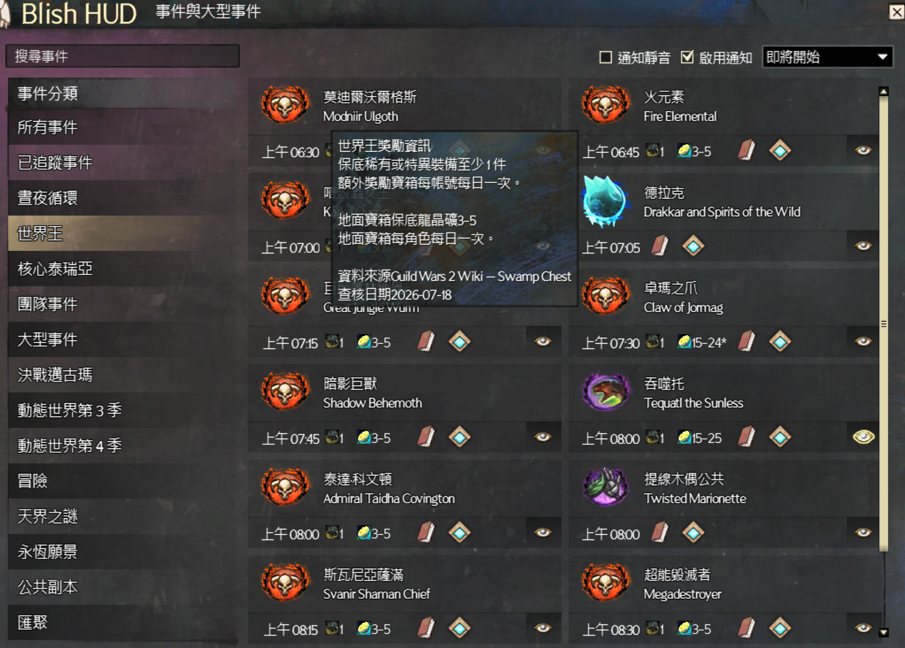

# Events and Metas Observer 台灣繁體中文版

Guild Wars 2 的 Blish HUD 活動行程與通知模組，提供台灣繁體中文介面、英文事件名稱對照、核心世界王獎勵資訊，以及世界首領、大型活動、匯流與冒險通知。



> 實機畫面：事件卡片同時顯示繁中與英文名稱；世界王卡片提供獎勵摘要，移至圖示上可查看每日限制、Wiki 來源與查核日期。

## 主要功能

- **繁中與英文名稱並列**：繁中名稱下方保留官方英文事件名稱，方便對照英文攻略；搜尋支援繁中、英文與既有別名。
- **13 隻核心世界王獎勵**：卡片顯示保底稀有／特異裝備最低件數與地面寶箱龍晶礦數量。
- **清楚標示每日限制**：滑鼠提示區分額外獎勵寶箱的每帳號每日限制，以及地面寶箱的每角色每日限制。
- **官方時程與傳送點**：活動時間、Wiki 連結與 waypoint 優先採用 Guild Wars 2 官方 Wiki Event Timer；連線失敗時依序使用成功快取與內建資料。
- **通知與事件追蹤**：可追蹤指定事件、調整通知位置、切換提示音，並快速複製附近傳送點。
- **專屬事件圖示**：晝夜循環、自動錦標賽、入侵與特殊事件使用穩定事件 ID 對應的辨識圖示。

## 獎勵資料來源

官方 Event Timer 本身不提供獎勵欄位。本模組的世界王獎勵資料逐項查核自目前的 [Guild Wars 2 Wiki](https://wiki.guildwars2.com/wiki/World_boss)，並連同來源頁面與查核日期內建於 [`event-rewards.json`](Events%20Module/ref/event-rewards.json)。執行時不會抓取 that_shaman 或其他第三方計時網站；未列入資料表的事件不會推測獎勵。

> [!IMPORTANT]
> 使用本繁中模組前，請先安裝支援中文的 Blish HUD。只安裝 `Events Module.bhm` 而使用官方英文版 Blish HUD，主程式介面仍可能顯示英文。事件卡片第二行的英文名稱則是本模組刻意保留的攻略對照功能，不代表翻譯失效。

## 安裝前置：中文 Blish HUD

1. 先閱讀[巴哈姆特《Blish HUD 中文版》教學](https://forum.gamer.com.tw/Co.php?bsn=16901&sn=139691)。
2. 前往 [m21248074/Blish-HUD Releases](https://github.com/m21248074/Blish-HUD/releases) 下載最新的中文版 Blish HUD，並依照上述教學完成安裝。
3. 確認中文 Blish HUD 可正常啟動後，再安裝本頁的 Events Module 繁中模組。

## 安裝 Events Module

1. 完全關閉 Blish HUD。
2. 從[GitHub Releases](https://github.com/jakeuj/Community-Module-Pack/releases/latest)下載最新的 `Events Module.bhm` 完整安裝包。
3. 將檔案放入：

   ```text
   %UserProfile%\Documents\Guild Wars 2\addons\blishhud\modules
   ```

   若「文件」資料夾由 OneDrive 同步，實際路徑可能位於 OneDrive 資料夾內。
4. 重新啟動 Blish HUD，在模組清單中找到 **Events and Metas Observer** 並啟用。

## 相關連結

- [Events and Metas Observer 繁中版官網](https://gw.jakeuj.com/)
- [GW2 ArcDPS 繁體中文 UI](https://github.com/jakeuj/GW2-ArcDPS-TChineseUI)
- [回報問題](https://github.com/jakeuj/Community-Module-Pack/issues)

## 聲明

本專案是 Community-Module-Pack 的社群繁體中文 fork，非 ArenaNet、Blish HUD 或原始模組作者的官方發行版。
